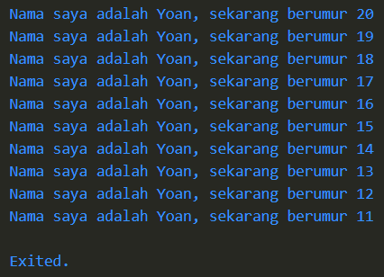

# Pengantar Bahasa Pemrogramman Dart - Bagian 1

## Tugas Praktikum

### Soal 1

```dart
void main() {
  for (int i = 0; i < 10; i++) {
    print('Nama saya adalah Yoan, sekarang berumur ${20 - i}');
  }
}
```
**output** :



### Soal 2

#### **Mengapa sangat penting untuk memahami bahasa pemrograman Dart sebelum kita menggunakan framework Flutter ? Jelaskan!**

__Jawaban:__ Karena Bahasa pemogramman Dart sangat penting sebelum menggunakan Flutter dikarenakan Flutter sepenuhnya dibangun menggunakan Dart. Penguasaan dasar Dart dapat memeudahkan dalam pengembangan aplikasi di Flutter.

### Soal 3

#### **Rangkumlah materi dari codelab ini menjadi poin-poin penting yang dapat Anda gunakan untuk membantu proses pengembangan aplikasi mobile menggunakan framework Flutter.**

**Jawaban:**
* Bahasa pemogramman Dart dikembangkan oleh Google yang awalnya sebagai alternatif Javascript.
* __Struktur Dart:__ Sintaks Dart mirip dengan C atau JavaScript, dengan operator standar, built-in types, dan control flow yang umum.
* __Object-Oriented:__ Dart mendukung prinsip OOP seperti inheritance, polymorphism, dan encapsulation.
* __Operator:__ Operator Dart adalah method dalam class, dan bisa disesuaikan.
* __Operator Aritmatika:__ Termasuk `+`, `-`, `*`, `/`, `~/`, dan `%`. `+` juga untuk menggabungkan string.
* __Penambahan & Pengurangan:__ `++var` dan `--var` untuk menambah atau mengurangi 1.
* __Kesetaraan & Relasional:__ `==`, `!=`, `>`, `<`, `>=`, dan `<=` untuk membandingkan isi variabel.
* __Operator Logika:__ `!`, `||`, dan `&&` untuk operasi logika.
