# Pengantar Bahasa Pemrogramman Dart - Bagian 2

## Praktikum 1

### Langkah 1:
```dart
void main() {
    String test = "test2";
    if (test == "test1") {
        print("Test1");
    } else If (test == "test2") {
        print("Test2");
    } Else {
        print("Something else");
    }

    if (test == "test2") print("Test2 again");
}
```

### Langkah 2:
__Silakan coba eksekusi (Run) kode pada langkah 1 tersebut. Apa yang terjadi? Jelaskan!__

**Output:**

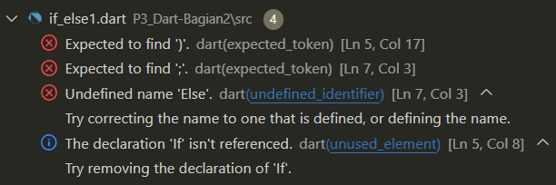


* _Terjadi error dikarenakan kesalahan sintaks pada `else If` dan `Else`._

### Langkah 3
```dart
String test = "true";
if (test) {
   print("Kebenaran");
}
```
__Apa yang terjadi ? Jika terjadi error, silakan perbaiki namun tetap menggunakan if/else.__

**Output:**

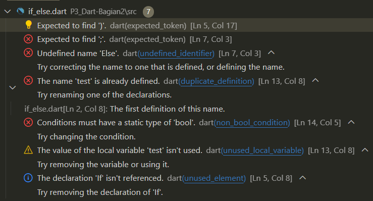

**Perbaikan:**
```dart
void main() {
  String test = "test2";
  if (test == "test1") {
    print("Test1");
  } else if (test == "test2") {
    print("Test2");
  } else {
    print("Something else");
  }

  if (test == "test2") print("Test2 again");

  test = "true";
  if (test == "true") {
    print("Kebenaran");
  }
}
```
**Output:**

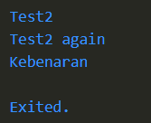

## Praktikum 2

### Langkah 1:
```dart
void main() {
    while (counter < 33) {
        print(counter);
        counter++;
    }
}
```

### Langkah 2:
__Silakan coba eksekusi (Run) kode pada langkah 1 tersebut. Apa yang terjadi? Jelaskan! Lalu perbaiki jika terjadi error.__

**Output:**

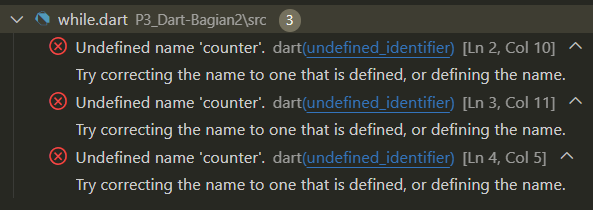

* _Terjadi error dikarenakan variabel counter belum dideklarasikan._

**Perbaikan:**
```dart
void main() {
  int counter = 30;

  while (counter < 33) {
    print(counter);
    counter++;
  }
}
```
**Output:**

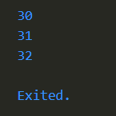

### Langkah 3:
```dart
void main() {
  int counter = 70;

  while (counter < 33) {
    print(counter);
    counter++;
  }

  do {
    print(counter);
    counter++;
  } while (counter < 77);
}
```
**Output:**

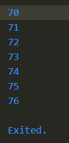

* _Nilai dari counter saya ganti dan kode tidak error saat dieksekusi._

## Praktikum 3

### Langkah 1:
```dart
void main() {
    for (Index = 10; index < 27; index) {
        print(Index);
    }
}
```

### Langkah 2:
__Silakan coba eksekusi (Run) kode pada langkah 1 tersebut. Apa yang terjadi? Jelaskan! Lalu perbaiki jika terjadi error.__

**Output** :

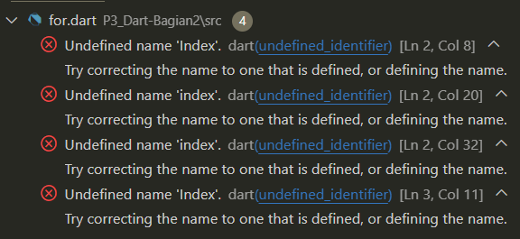

* _Terjadi error dikarenakan beberapa kesalahan. Kesalah pertama dikarenakan kesalahan sintaks pada `Index`, kesalahan kedua terjadi karena deklarasi `index` tidak diberikan tipe data, kesalahan ketiga pada inkremen di dalam for loop, seharusnya menggunakan `index++`._

**Perbaikan:**
```dart
void main() {
  for (int index = 10; index < 27; index++) {
    print(index);
  }
}
```
**Output:**

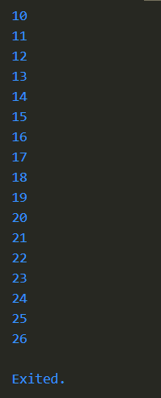

### Langkah 3:
```dart
void main() {
  for (int index = 10; index < 27; index++) {
    print(index);
    If (Index == 21) break;
    Else If (index > 1 || index < 7) continue;
    print(index);
  }
}
```
**Output:**

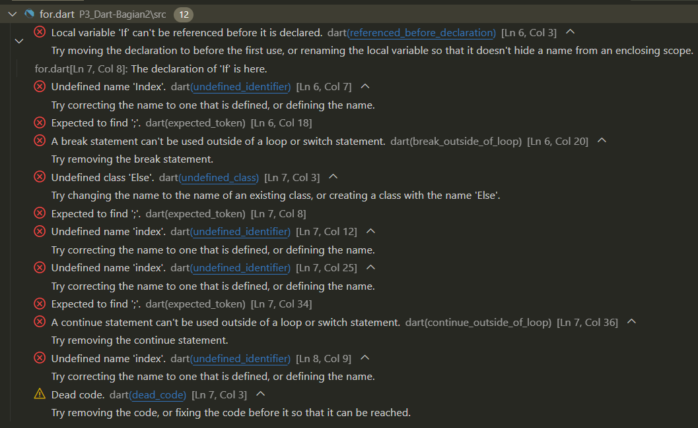

* _Terjadi error karena kesalahan sintaks pada `If`, `Else If`, dan `Index`._

**Perbaikan:**
```dart
void main() {
  for (int index = 10; index < 27; index++) {
    print(index);
    if (index == 21) {
      break;
    } else if (index > 1 || index < 7) {
      continue;
    }
    print(index);
  }
}
```
**Output:**

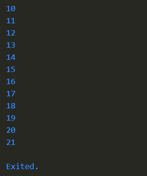

## Tugas Praktikum

**Buatlah sebuah program yang dapat menampilkan bilangan prima dari angka 0 sampai 201 menggunakan Dart. Ketika bilangan prima ditemukan, maka tampilkan nama lengkap dan NIM Anda.**

```dart
void main() {
  int bil = 0;
  int count = 0;
  int target = 201;
  int mulai = bil;
  do {
    if (bil <= 1) {
      bil++;
    } else if (bil == 2) {
      print('$bil, Muhammad Yoanvari Al Farizi 2241720096');
      bil++;
      count++;
    } else {
      for (int i = 2; i < bil; i++) {
        if (bil % i == 0) {
          break;
        } else if (i == bil - 1) {
          print('$bil, Muhammad Yoanvari Al Farizi 2241720096');
          count++;
        }
      }
      bil++;
    }
  } while (bil <= target);
  print('Terdapat $count bilangan prima dari $mulai sampai $target');
}
```

**Output:**

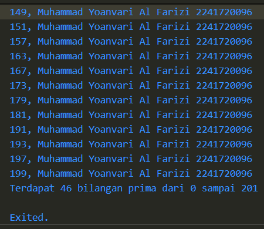