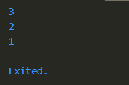

# Pengantar Bahasa Pemrogramman Dart - Bagian 2

## Praktikum 1 : Eksperimen Tipe Data List

### Langkah 1
```dart
void main() {
  var list = [1, 2, 3];
  assert(list.length == 3);
  assert(list[1] == 2);
  print(list.length);
  print(list[1]);

  list[1] = 1;
  assert(list[1] == 1);
  print(list[1]);
}
```

### Langkah 2
**Silakan coba eksekusi (Run) kode pada langkah 1 tersebut. Apa yang terjadi? Jelaskan!**

*Output:*



_menggunakan assertion untuk memastikan panjang list adalah 3 dan elemen pada indeks ke-1 bernilai 2, setelah itu mencetak panjang list dan elemen pada indeks ke-1. Elemen pada indeks ke-1 diubah menjadi 1, kemudian diverifikasi dengan assertion lalu dicetak._

### Langkah 3
**Ubah kode pada langkah 1 menjadi variabel final yang mempunyai index = 5 dengan default value = null. Isilah nama dan NIM Anda pada elemen index ke-1 dan ke-2. Lalu print dan capture hasilnya. Apa yang terjadi ? Jika terjadi error, silakan perbaiki.**
```dart
void main() {
  final List<String?> list = List.filled(5, null);

  list[1] = "Muhammad Yoanvari Al Farizi";
  list[2] = "2241720096";

  print(list);
}
```
*Output:*


## Praktikum 2: Eksperimen Tipe Data Set

### Langkah 1
```dart
void main() {
  var halogens = {'fluorine', 'chlorine', 'bromine', 'iodine', 'astatine'};
  print(halogens);
}
```

### Langkah 2
**Silakan coba eksekusi (Run) kode pada langkah 1 tersebut. Apa yang terjadi? Jelaskan! Lalu perbaiki jika terjadi error.**

*Output:*


_mendeklarasikan sebuah set helogens dan mencetaknya. Set adalah collection unik yang tidak terurut._

### Langkah 3
```dart
void main() {
  var names1 = <String>{};
  Set<String> names2 = {};
  var names3 = {};

  print(names1);
  print(names2);
  print(names3);
}
```

**Apa yang terjadi ? Jika terjadi error, silakan perbaiki namun tetap menggunakan ketiga variabel tersebut. Tambahkan elemen nama dan NIM Anda pada kedua variabel Set tersebut dengan dua fungsi berbeda yaitu .add() dan .addAll(). Untuk variabel Map dihapus, nanti kita coba di praktikum selanjutnya.**

*Output:*


**Perbaikan**
```dart
void main() {
  var names1 = <String>{};
  Set<String> names2 = {};

  names1.add("Muhammad Yoanvari Al Farizi");
  names1.add("2241720096");

  names2.addAll({"Muhammad Yoanvari Al Farizi", "2241720096"});

  print(names1);
  print(names2);
}
```

*Output:*


## Praktikum 3: Eksperimen Tipe Data Maps

### Langkah 1
```dart
void main() {
  var gifts = {
    // Key:    Value
    'first': 'partridge',
    'second': 'turtledoves',
    'fifth': 1
  };

  var nobleGases = {
    2: 'helium',
    10: 'neon',
    18: 2,
  };

  print(gifts);
  print(nobleGases);
}
```

### Langkah 2
**Silakan coba eksekusi (Run) kode pada langkah 1 tersebut. Apa yang terjadi? Jelaskan! Lalu perbaiki jika terjadi error.**

*Output:*


__

### Langkah 3
```dart
void main() {
  var gifts = {
    // Key:    Value
    'first': 'partridge',
    'second': 'turtledoves',
    'fifth': 1
  };

  var nobleGases = {
    2: 'helium',
    10: 'neon',
    18: 2,
  };

  print(gifts);
  print(nobleGases);

  var mhs1 = Map<String, String>();
  gifts['first'] = 'partridge';
  gifts['second'] = 'turtledoves';
  gifts['fifth'] = 'golden rings';

  var mhs2 = Map<int, String>();
  nobleGases[2] = 'helium';
  nobleGases[10] = 'neon';
  nobleGases[18] = 'argon';
}
```
_kode berjalan tanpa error. Namun, terdapat variabel mhs1 dan mhs2 yang dideklarasi tetapi tidak digunakan. Selain itu, pengaturan ulang nilai pada Map gifts dan nobleGases bersifat redudan, karena nilai tersebut sudah ditetapkan sejak awal._

**Perbaikan**
```dart
var mhs1 = Map<String, String>();
mhs1['first'] = 'partridge';
mhs1['second'] = 'turtledoves';
mhs1['fifth'] = 'golden rings';

var mhs2 = Map<int, String>();
mhs2[2] = 'helium';
mhs2[10] = 'neon';
mhs2[18] = 'argon';

print(mhs1);
print(mhs2);
```

**Tambahkan elemen nama dan NIM Anda pada tiap variabel di atas (`gifts`, `nobleGases`, `mhs1`, dan `mhs2`). Dokumentasikan hasilnya dan buat laporannya!**

```dart
void main() {
  var gifts = {
    // Key:    Value
    'first': 'partridge',
    'second': 'turtledoves',
    'fifth': 1
  };

  var nobleGases = {
    2: 'helium',
    10: 'neon',
    18: 2,
  };

  var mhs1 = Map<String, String>();
  mhs1['first'] = 'partridge';
  mhs1['second'] = 'turtledoves';
  mhs1['fifth'] = 'golden rings';

  var mhs2 = Map<int, String>();
  mhs2[2] = 'helium';
  mhs2[10] = 'neon';
  mhs2[18] = 'argon';

  gifts['nim'] = 2241720096;
  gifts['nama'] = 'Muhammad Yoanvari Al Farizi';
  nobleGases[1] = 2241720096;
  nobleGases[3] = 'Muhammad Yoanvari Al Farizi';
  mhs1['nim'] = '2241720096';
  mhs1['nama'] = 'Muhammad Yoanvari Al Farizi';
  mhs2[1] = '2241720096';
  mhs2[3] = 'Muhammad Yoanvari Al Farizi';

  print(gifts);
  print(nobleGases);
  print(mhs1);
  print(mhs2);
}
```

*Output:*


## Praktikum 4: Eksperimen Tipe Data Data List: Spread dan Control-flow Operators

### Langkah 1
```dart
void main() {
  var list = [1, 2, 3];
  var list2 = [0, ...list];
  print(list1);
  print(list2);
  print(list2.length);
}
```

### Langkah 2
**Silakan coba eksekusi (Run) kode pada langkah 1 tersebut. Apa yang terjadi? Jelaskan! Lalu perbaiki jika terjadi error.**

*Output:*


_Terjadi error, karena variabel `list1` tidak pernah dideklarasikan._

**Perbaikan**
```dart
void main() {
  var list = [1, 2, 3];
  var list2 = [0, ...list];
  print(list);
  print(list2);
  print(list2.length);
}
```

*Output:*


### Langkah 3
```dart
void main() {
  var list = [1, 2, 3];
  var list2 = [0, ...list];
  print(list);
  print(list2);
  print(list2.length);

  list1 = [1, 2, null];
  print(list1);
  var list3 = [0, ...?list1];
  print(list3.length);
}
```
_Terjadi error dikarenakan variabel `list1` belum dideklarasikan sebelum digunakan._

**Perbaikan**
```dart
void main() {
  var list = [1, 2, 3];
  var list2 = [0, ...list];
  print(list);
  print(list2);
  print(list2.length);

  var list1 = [1, 2, null];
  print(list1);
  var list3 = [0, ...?list1];
  print(list3.length);
}
```
*Output:*


**Tambahkan variabel list berisi NIM Anda menggunakan Spread Operators. Dokumentasikan hasilnya dan buat laporannya!**

**Penambahan**
```dart
var listNim = [2241720096];
list3 = [...listNim];
print(list3);
```
*Output:*


### Langkah 4
```dart
void main() {
  var nav = ['Home', 'Furniture', 'Plants', if (promoActive) 'Outlet'];
  print(nav);
}
```

**Apa yang terjadi? jika terjadi error, silahkan perbaiki. Tunjukan hasilnya jika variabel `promoActive` ketika `true` dan `false`**

*Output:*


**Perbaikan**
_promoActive bernilai True_
```dart
void main() {
  var promoActive = true;
  var nav = ['Home', 'Furniture', 'Plants', if (promoActive) 'Outlet'];
  print(nav);
}
```
*Output:*


_promoActive bernilai False_
```dart
void main() {
  var promoActive = false;
  var nav = ['Home', 'Furniture', 'Plants', if (promoActive) 'Outlet'];
  print(nav);
}
```
*Output:*


### Langkah 5
```dart
void main() {
  var nav2 = [
    'Home',
    'Furniture',
    'Plants',
    if (login case 'Manager') 'Inventory'
  ];
  print(nav2);
}
```
**Apa yang terjadi? Jika terjadi error, silakan perbaiki. Tunjukkan hasilnya jika variabel login mempunyai kondisi lain.**

*Output:*


**Perbaikan**
```dart
void main() {
  var login = 'Manager';
  var nav2 = [
    'Home',
    'Furniture',
    'Plants',
    if (login case 'Manager') 'Inventory'
  ];
  print(nav2);
}
```
*Output:*


```dart
void main() {
  var login = 'Admin';
  var nav2 = [
    'Home',
    'Furniture',
    'Plants',
    if (login case 'Manager') 'Inventory'
  ];
  print(nav2);
}
```
*Output:*


### Langkah 6
```dart
void main() {
  var listOfInts = [1, 2, 3];
  var listOfStrings = ['#0', for (var i in listOfInts) '#$i'];
  assert(listOfStrings[1] == '#1');
  print(listOfStrings);
}
```
**Apa yang terjadi ? Jika terjadi error, silakan perbaiki. Jelaskan manfaat Collection For dan dokumentasikan hasilnya.**

*Output:*


_Collection For dalam Dart memudahkan pembuatan collection secara ringkas dan efisien dengan menggunakan perulangan langsung dalam deklarasi collection. Hal ini membuat kode lebih bersih, mudah dibaca, dan mengurangi kesalahan._

## Praktikum 5: Eksperimen Tipe Data Records

### Langkah 1
```dart
void main() {
  var record = ('first', a: 2, b: true, 'last');
  print(record)
}
```

### Langkah 2
**Silakan coba eksekusi (Run) kode pada langkah 1 tersebut. Apa yang terjadi? Jelaskan! Lalu perbaiki jika terjadi error.**

_Terjadi error dikarenakan tidak ada `;` setelah sintaks `print(record)`._

*Output:*


### Langkah 3
```dart
void main() {
  var record = ('first', a: 2, b: true, 'last');
  print(record);
}

(int, int) tukar((int, int) record) {
  var (a, b) = record;
  return (b, a);
}
```
**Apa yang terjadi? Jika terjadi error, silakan perbaiki. Gunakan fungsi tukar() di dalam main() sehingga tampak jelas proses pertukaran value field di dalam Records.**

_Output sama saja dikarenakan fungsi `tukar()` belum digunakan di dalam `main()`._

**Perbaikan**
```dart
void main() {
  var record = (2, 1);
  print('sebelum ditukar: $record');

  var swapRecord = tukar(record);
  print('setelah ditukar: $swapRecord');
}

(int, int) tukar((int, int) record) {
  var (a, b) = record;
  return (b, a);
}
```
*Output:*


### Langkah 4
```dart
void main() {
  // Record type annotation in a variable declaration:
  (String, int) mahasiswa;
  print(mahasiswa);
}
```
**Apa yang terjadi ? Jika terjadi error, silakan perbaiki. Inisialisasi field nama dan NIM Anda pada variabel record mahasiswa di atas. Dokumentasikan hasilnya dan buat laporannya!**

_Terjadi error dikarenakan variabel `mahasiswa` dideklarasikan dengan tipe record `(String, int)` tetapi belum diinisialisasi dengan nilai awal._

**Perbaikan**
```dart
void main() {
  // Record type annotation in a variable declaration:
  (String, int) mahasiswa = ('Muhammad Yoanvari Al Farizi', 2241720096);
  print(mahasiswa);
}
```
*Output:*


### Langkah 5
```dart
void main() {
  var mahasiswa2 = ('first', a: 2, b: true, 'last');

  print(mahasiswa2.$1); // Prints 'first'
  print(mahasiswa2.a); // Prints 2
  print(mahasiswa2.b); // Prints true
  print(mahasiswa2.$2); // Prints 'last'
}
```
*Output:*


**Apa yang terjadi ? Jika terjadi error, silakan perbaiki. Gantilah salah satu isi record dengan nama dan NIM Anda, lalu dokumentasikan hasilnya dan buat laporannya!**

```dart
void main() {
  var mahasiswa2 = ('Muhammad Yoanvari Al Farizi', a: 2241720096, b: true, 'last');

  print('Nama: ${mahasiswa2.$1}');
  print('NIM: ${mahasiswa2.a}');
}
```
*Output:*


## Tugas Praktikum
1. **Jelaskan yang dimaksud Functions dalam bahasa Dart!**
    * _Blok kode yang dapat digunakan kembali dan berfungsi untuk melakukan tugas tertentu. Functions dapat menerima input (parameter) dan mengembalikan output (return value)._
2. **Jelaskan jenis-jenis parameter di Funcions beserta contoh sintaksnya!**
    * _Positional Parameters (Parameter Posisi):_
    ```dart
    void greet(String name, int age) {
      print('Hello $name, you are $age years old.');
    }
    ```
    * _Optional Positional Parameters (Parameter Posisi Opsional):_
    ```dart
    void greet(String name, [int age]) {
      print('Hello $name, age is ${age ?? 'unknown'}');
    }
    ```
    * _Named Parameters (Parameter Berlabel):_
    ```dart
    void greet({String name, int age}) {
      print('Hello $name, age is $age');
    }

    void main() {
      greet(name: 'Yoanvari', age: 22);
    }
    ```
    * _Default Parameters (Parameter Default):_
    ```dart
    void greet({String name = 'User', int age = 18}) {
      print('Hello $name, age is $age');
    }
    ```
3. **Jelaskan maksud Functions sebagai first-class objects beserta contoh sintaknya!**
    * _function yang dapat disimpan dalam variabel, diteruskan sebagai parameter ke function lain, atau dikembalikan dari function._
    ```dart
    void printMessage() {
      print('Hello from function!');
    }

    void executeFunction(Function fn) {
      fn();
    }

    void main() {
      var myFunction = printMessage;
      executeFunction(myFunction);
    }
    ```
4. **Apa itu Anonymous Functions? Jelaskan dan berikan contohnya!**
    * _fungsi yang tidak memiliki nama. Mereka biasanya digunakan ketika fungsi hanya dibutuhkan sekali atau untuk tugas sederhana._
    ```dart
    void main() {
      var list = [1, 2, 3];
      
      list.forEach((item) {
        print('Item: $item');
      });
    }
    ```
5. **Jelaskan perbedaan Lexical scope dan Lexical closures! Berikan contohnya!**
    * _Lexical Scope: variabel yang didefinisikan dalam sebuah fungsi hanya dapat diakses dalam fungsi tersebut atau fungsi yang didefinisikan di dalamnya._
    ```dart
    void main() {
      var name = 'Yoanvari';
      
      void greet() {
        print('Hello $name');
      }

      greet(); // Bisa mengakses 'name'
    }
    ```
    * _Lexical Closures: fungsi yang dapat "mengikat" variabel dari lingkup (scope) di sekitarnya bahkan setelah lingkup tersebut berakhir. Ini memungkinkan fungsi untuk mengingat lingkup di mana ia dideklarasikan._
    ```dart
    Function createAdder(int addBy) {
      return (int i) => i + addBy;
    }

    void main() {
      var add2 = createAdder(2);
      print(add2(3)); // Output: 5
    }
    ```
6. **Jelaskan dengan contoh cara membuat return multiple value di Functions!**
    ```dart
    List<int> getCoordinates() {
      return [10, 20];
    }

    void main() {
      var coordinates = getCoordinates();
      print('x: ${coordinates[0]}, y: ${coordinates[1]}');
    }
    ```
    * _Pada contoh diatas, function getCoordinates() mengembalikan dua nilai yang bisa diakses sekaligus._